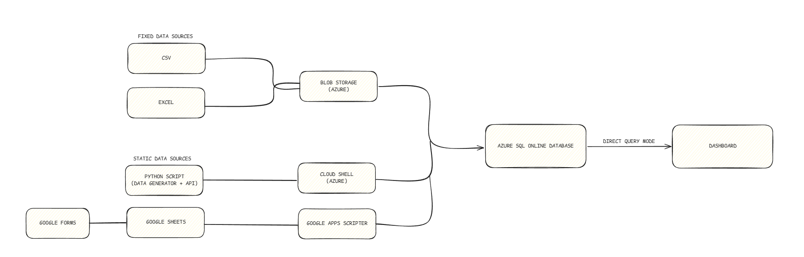
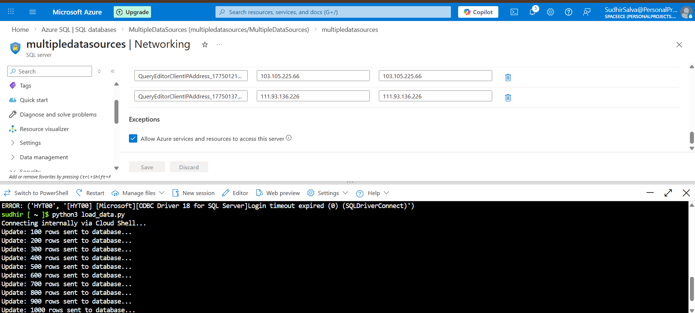
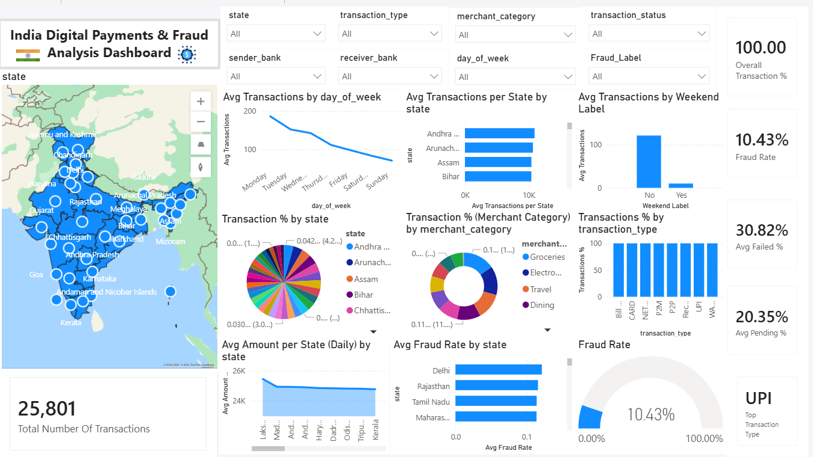

# 📊 Project 3: End-to-End Data Pipeline with Multi-Source Integration (Azure + Power BI)  

---

## 🚀 Project Overview  

This project focuses on building a **complete data pipeline** by integrating multiple data sources into a single system and visualizing them in real-time using Power BI.  

Unlike my previous projects which focused on concepts, this project is fully **implementation-based**, where I built an **end-to-end workflow** from data collection to live dashboard updates.  

The goal was to simulate a **real-world data engineering and analytics pipeline**.

---

## 🧩 Architecture (Data Flow Diagram)  

---

## 📂 Data Sources  

The project uses multiple types of data sources:

- CSV File → 22,801 transactions  
- Excel File → 1,000 transactions  
- Python Script → 1,000 transactions (generated dynamically)  
- Google Sheets → 1,000 transactions (collected via Google Forms)  

---

## 🗂️ Data Source Types  

### 1️⃣ Fixed Data Sources  
- CSV and Excel files  
- Data does not change automatically  
- Stored in Azure Blob Storage  

### 2️⃣ Live / Streaming Data Sources  
- Python Script → Generates and sends data in real-time  
- Google Sheets → Stores responses and sends data using Apps Script (JSON format)  

---

## 🛠️ Tech Stack  

- Python  
- Azure Blob Storage  
- Azure Cloud Shell  
- Azure SQL Database  
- Google Sheets & Google Apps Script  
- Power BI (Direct Query Mode)  

---

## 🔄 Data Flow  

1. CSV & Excel → Uploaded to Azure Blob Storage  
2. Blob Storage → Data loaded into Azure SQL Database  
3. Python Script → Runs in Azure Cloud Shell → Sends live data  
4. Google Forms → Google Sheets → Apps Script → Azure SQL  
5. Azure SQL → Connected to Power BI using Direct Query  
6. Dashboard updates in near real-time  

### ☁️ Azure Cloud Shell Execution  

This step is executed using Azure Cloud Shell to securely connect and push data into the database.

---

## 🗄️ Data Warehouse  

Azure SQL Database acts as the **central data warehouse**, where all data from multiple sources is stored and managed for analysis.  

---

## ⚡ What is Direct Query Mode?  

Direct Query Mode allows Power BI to fetch data **directly from the database in real-time**, instead of storing it inside the dashboard.  

This ensures:
- Live data updates  
- No manual refresh required  
- Better handling of large datasets  

---

## 📊 Dashboard Preview  

---

## 📁 Project Resources  

- 📸 Screenshots → [View Folder](./screenshots)  
- 📂 Resources → [View Folder](./resources)  

---

## 📈 Key Features  

- Real-time dashboard updates  
- Multi-source data integration  
- Fraud detection and transaction analysis  
- State-wise insights across India  
- Cloud-based scalable architecture  

---

## 🎯 Learnings  

- Built an end-to-end data pipeline  
- Worked with Azure cloud services  
- Understood real-time data processing  
- Implemented Direct Query in Power BI  
- Strengthened data engineering and analytics skills  

---

## 🔮 Future Improvements  

- Add automated data pipelines (scheduling)  
- Implement data transformation (ETL process)  
- Improve dashboard insights and storytelling  
- Add real-time streaming data integration  

---

## ✅ Conclusion  

This project helped me move beyond theory and focus on **practical implementation of data pipelines**.  

It gave me hands-on experience in both:
- Data Engineering (pipeline building, cloud integration)  
- Data Analytics (dashboard creation, insights)  

I plan to focus more on data engineering in my upcoming projects, as I am more interested in building data pipelines.
